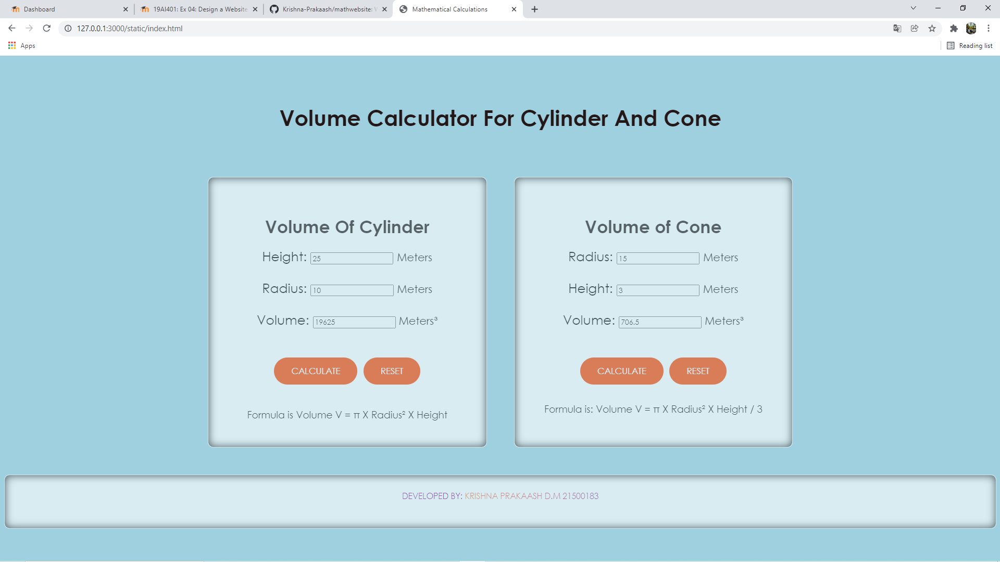
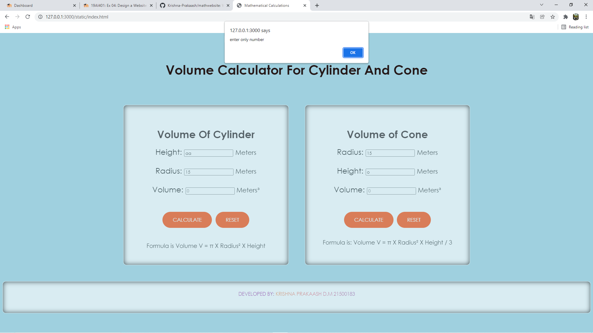

# Web Page for Mathematical Calculations

## AIM:

To design a static website with validation to perform mathematical calculations in client side.

## DESIGN STEPS:

### Step 1:

Requirement collection.

### Step 2:

Creating the layout using HTML and CSS.

### Step 3:

Write javascript to perform the calculations.

### Step 4:

Include regularexpression based input validation.

### Step 5:

Validate the layout in various browsers.

### Step 6:

Validate the HTML code.

### Step 6:

Publish the website in the given URL.

## PROGRAM :

<!DOCTYPE html>
<html lang="en">

<head>
  <meta charset="UTF-8">

  <meta http-equiv="X-UA-Compatible" content="IE=edge">
  <meta name="viewport" content="width=device-width, initial-scale=1.0">
  <title>Mathematical Calculations</title>
</head>

<body>

  

    <h1><small>Volume Calculator For Cylinder And Cone</small></h1>
  

  

    

      <h1>Volume Of Cylinder</h1>
      <form>
        

          <lable for="aedit">Height:</lable>
          <input id="aedit" placeholder="" />
          <label><small>
          Meters
          </small></label>
        
 
        

          <lable for="bedit">Radius:</lable>
          <input id="bedit" placeholder="" />
            <label><small>
            Meters
            </small></label>
        
 
        

          <lable for="cedit">Volume:</lable>
          <input type="number" min="0" value="0" step="any" id="cedit" placeholder="0" readonly="0" /><label><small>
              Meters³</small></label>
        
  
        

          <input type="button" class="button" value="CALCULATE" id="calbutton1" />
          <input type="Reset" class="button" value="RESET">
        

        

         
        

          Formula is
          Volume V = π X Radius² X Height
        
 
      </form>
    

    

      <h1>Volume of Cone</h1>
      <form>
        

          <lable for="radiusedit">Radius:</lable>
          <input id="radiusedit" placeholder="" />
          <label><small>
              Meters
            </small></label>
        
 
        

          <lable for="heightedit">Height:</lable>
          <input id="heightedit" placeholder="" />
          <label><small>
              Meters
            </small></label>
        
 
        

          <lable for="volumeedit">Volume:</lable>
          <input type="number" min="0" value="0" name="avol" step="any" id="volumeedit" placeholder="0"
            readonly="0" /><label><small> Meters³</small></label>
        
  
        

          <input type="button" class="button" value="CALCULATE" id="calbutton2" />
          <input type="Reset" class="button" value="RESET">
        
 
        

          Formula is:
          Volume V = π X Radius² X Height / 3
        

        
         
      </form>

    

  

  

</body>

  

    

      
 DEVELOPED BY:<a><u> KRISHNA PRAKAASH D.M 21500183</u></a>
      

    

  

</html>

## OUTPUT:

## ERROR:

## Result:

Thus a website is designed to perform mathematical calculations in the client side.
